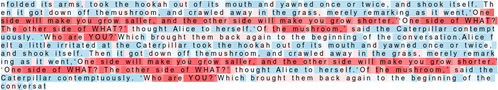
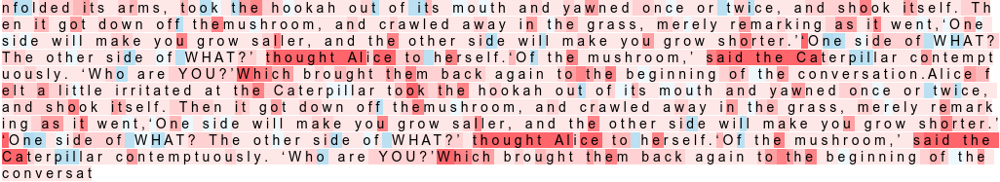
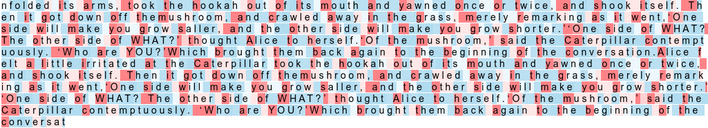

# Visualizing LSTM Activations in Keras

You can read in detail about this on [Medium](https://medium.com/@praneet9/visualising-lstm-activations-in-keras-b50206da96ff)

## Dependencies
* Python - 3.x
* Keras - 2.2.5
* Tensorflow - 1.15.0

## Dataset
[wonderland.txt](https://github.com/Praneet9/Text_Generation/blob/master/wonderland.txt)

## Weights
[weights-improvement-303-0.2749_wonderland.hdf5](https://github.com/Praneet9/Text_Generation/blob/master/weights-improvement-303-0.2749_wonderland.hdf5)

## Visualization

#### Cell Number 189

#### Cell Number 435

#### Cell Number 463

